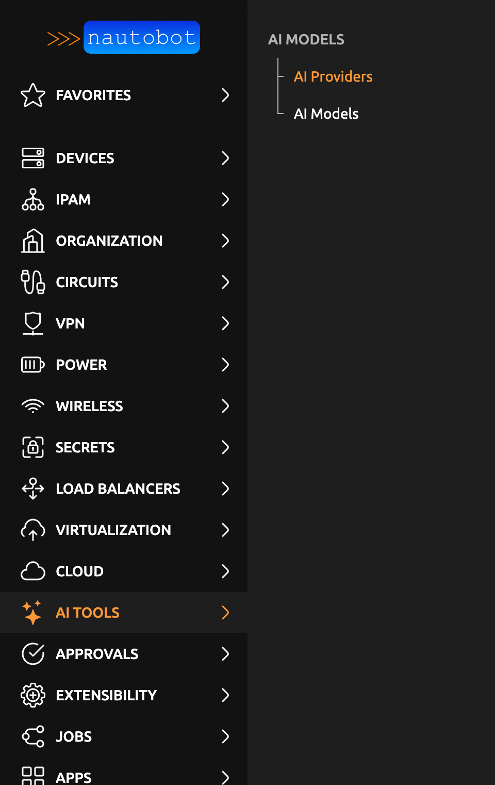
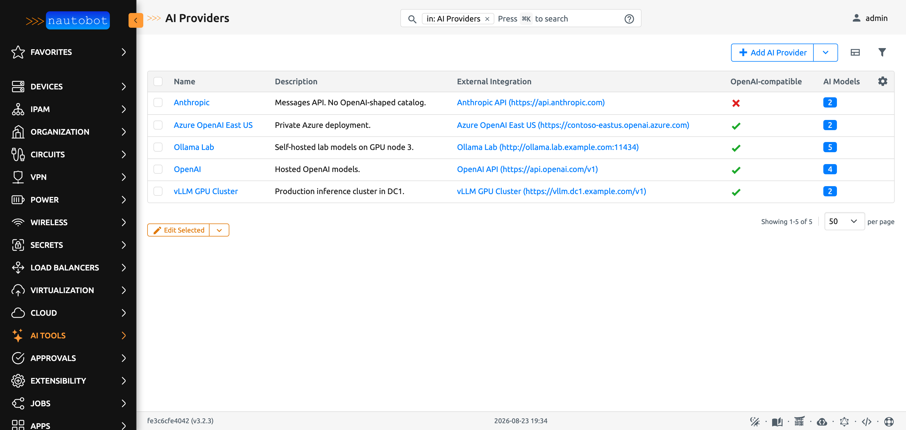
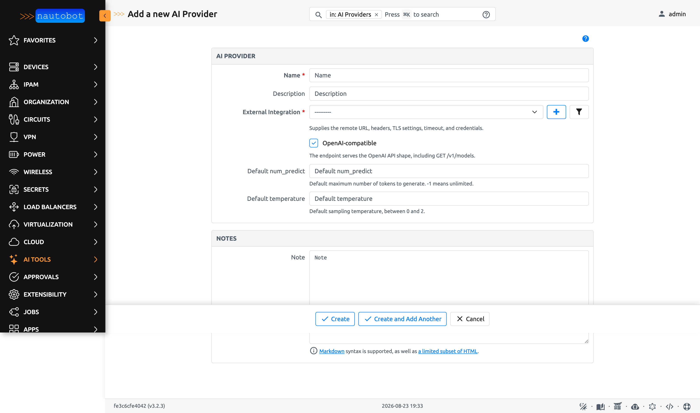
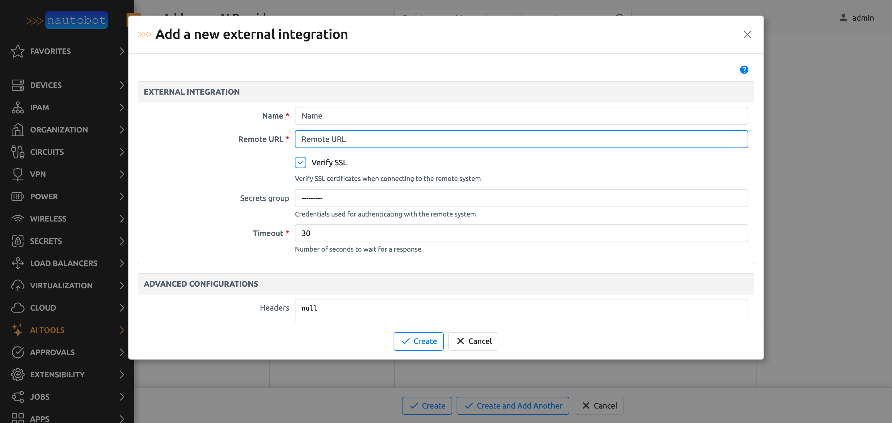
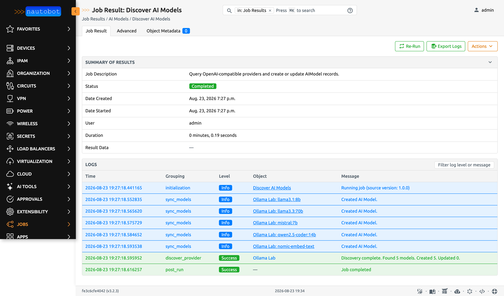
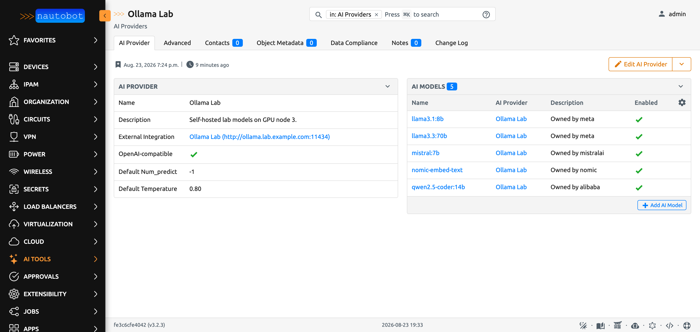
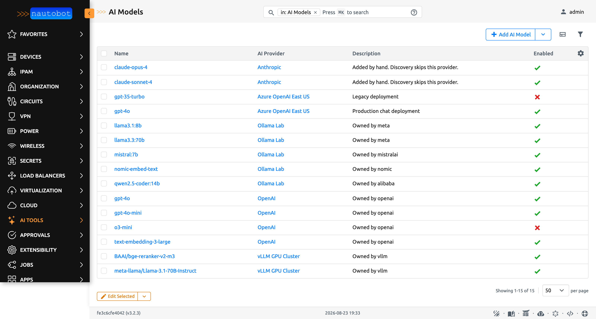

# Using the App

This document describes common use-cases and scenarios for this App.

## General Usage

The app adds two lists under the **AI Tools → AI Models** menu: **AI Providers** and **AI Models**.





## Use-cases and common workflows

### Add a provider

1. Go to **AI Tools → AI Models → AI Providers**, then select **Add**.
2. Enter a **Name**.
3. Choose an **External Integration**. If the one you need does not exist yet, select the **+**
   button beside the field. A modal opens, you create the External Integration in place, and the new
   record is selected for you. You never leave the provider form.
4. Leave **OpenAI-compatible** checked if the endpoint serves `GET /v1/models`.
5. Optionally set a default **num_predict** and **temperature**.



The **+** button beside the field opens this modal. Fill it in, select **Create**, and the new
External Integration is selected on the provider form behind it.



### Discover the models a provider offers

Run **Jobs → AI Models → Discover AI Models**.

The job reads `GET <remote_url>/v1/models` from each OpenAI-compatible provider and syncs the
result. It is safe to run repeatedly:

- A model in the response that is not in the database is created.
- A model already in the database keeps its `enabled`, `num_predict`, and `temperature` values. A
  user may have set them by hand, so the job never overwrites them.
- A model in the database that the provider no longer offers is **logged and kept**. The job never
  deletes a record.

Leave **AI Provider** empty to run against every provider. Uncheck **Enable new models** to create
new records in the disabled state for review.

A provider that is not OpenAI-compatible is skipped, and the job says so. No standard discovery
endpoint exists for those.



The provider detail view lists everything the job found.



### Override an inference parameter for one model

`num_predict` and `temperature` exist on both models. The provider value is the default. The model
value is an override. Leave the model value empty to inherit.

Read the effective value from the ORM:

```python
ai_model.resolved_num_predict
ai_model.resolved_temperature
```

### Retire a model without deleting it

Clear the **Enabled** checkbox. The record stays, its history stays, and the discovery job leaves
the flag alone. Consumers should skip a disabled model.

## Screenshots

The AI Models list shows every model across every provider. Filter it by provider, by enabled
state, or by name.


